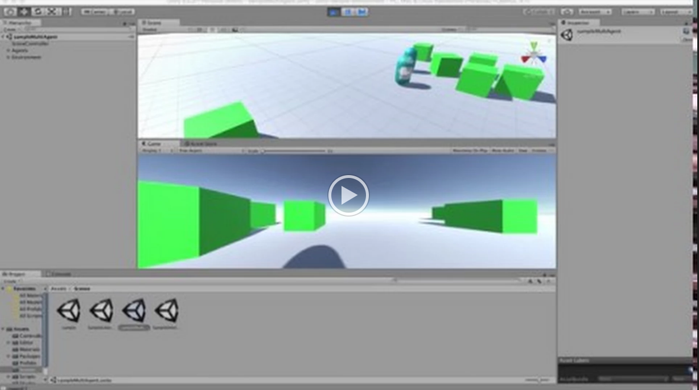
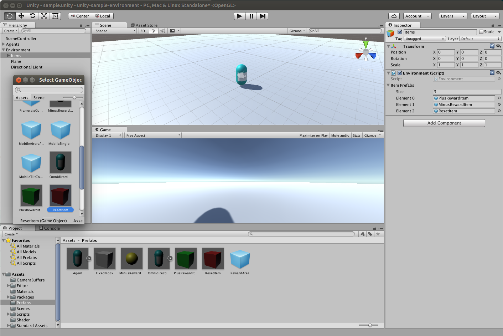
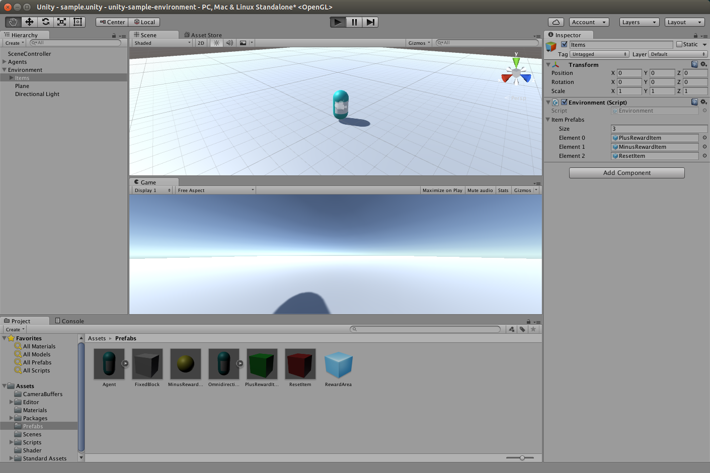
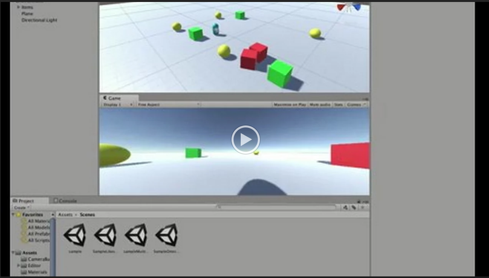

# lecture2017s-agent-system

- [My Gdrive](https://drive.google.com/drive/u/1/folders/0B9P1L--7Wd2vbEpHM2JMckxZWms)


## 2017-04-26

- Install [Life in Silico](https://github.com/wbap/lis). ([PPT](https://drive.google.com/open?id=0B9P1L--7Wd2vbnhzTU1hRXRUR0U))
- Multi-agent sample:

```bash
python multi_agent.py --agent-count 2
```

[](https://drive.google.com/open?id=0B9P1L--7Wd2vQ0M4UTRYZ2RoMnM)


## Next lecture assignment

- Load objects other than green box. Below figures are step 1-4.

 
 

- Load mesh model.


- Single agent sample:

```bash
python server.py
```

[](https://drive.google.com/open?id=0B9P1L--7Wd2vdDhmMlVWWjRiNDA)
